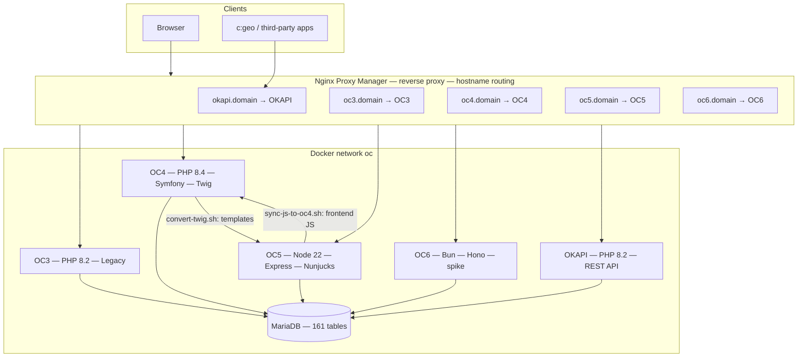
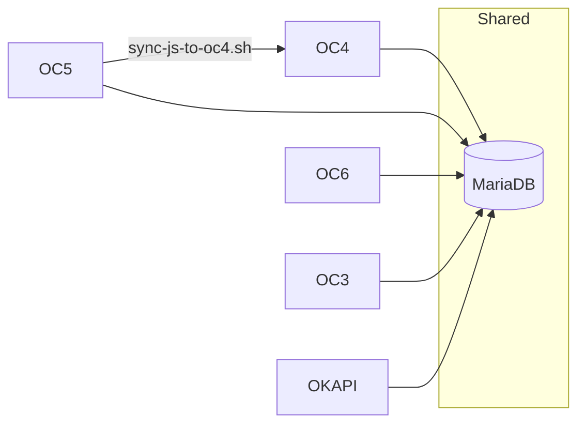
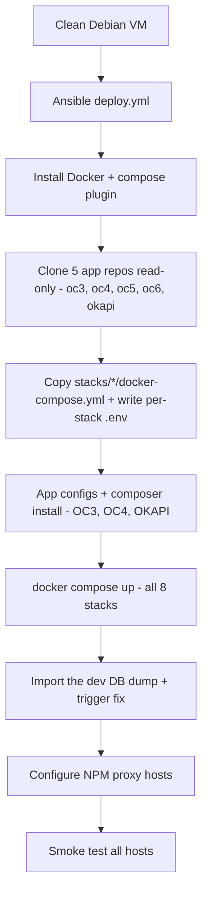

# OC Docker Stack — Architecture & Comparison

8 Docker stacks · 5 applications · 1 shared database · rebuilt from scratch by one Ansible playbook.

*Updated 2026-10-06. Hostnames are written as `<app>.<domain>`.*

---

## 1. Infrastructure Overview


```mermaid
flowchart TD
    U[Browser] --> NPM
    CGEO[c:geo / third-party apps] --> R5
    NPM --> A
    NPM --> B
    NPM --> C
    NPM --> G
    NPM --> D
    A --> E
    B --> E
    C --> E
    G --> E
    D --> E
    B -->|convert-twig.sh: templates| C
    C -->|sync-js-to-oc4.sh: frontend JS| B
    subgraph Clients
        U
        CGEO
    end
    subgraph NPM[Nginx Proxy Manager — reverse proxy — hostname routing]
        direction LR
        R1[oc3.domain → OC3]
        R2[oc4.domain → OC4]
        R3[oc5.domain → OC5]
        R4[oc6.domain → OC6]
        R5[okapi.domain → OKAPI]
    end
    subgraph OC[Docker network oc]
        A[OC3 — PHP 8.2 — Legacy]
        D[OKAPI — PHP 8.2 — REST API]
        B[OC4 — PHP 8.4 — Symfony — Twig]
        C[OC5 — Node 22 — Express — Nunjucks]
        G[OC6 — Bun — Hono — spike]
        E[(MariaDB — 161 tables)]
    end
```

Eight Docker stacks: dockge, npm, mariadb, oc3, oc4, oc5, oc6, okapi.

**Two client paths:**
- **Browsers** → NPM (reverse proxy) → the OC3 / OC4 / OC5 / OC6 frontends
- **c:geo and third-party apps** → OKAPI REST API (JSON), also through NPM

OKAPI is the public API surface: mobile apps, partner sites and tools use it.
The frontends serve HTML pages to browsers only.

NPM routes by Host header. All containers share one Docker network and one MariaDB.

**Two frontend codebases.**
- **OC3** keeps its original frontend: Smarty templates, jQuery, webpack/encore.
- **OC4 and OC5** run the same frontend: 27 ES modules, CSS, and vendor libraries (Leaflet, Tabulator, Bootstrap).
  - The code lives in both repos. OC5 (`public/js/`) is where it gets edited; `oc/scripts/sync-js-to-oc4.sh` copies it to OC4 (`public/_frontend/js/`) and rewrites the asset paths.
  - So a fix is written once and lands in both apps by script, not by hand-copying.
  - An earlier shared git submodule (`oc-frontend`) was dropped in favour of this, so both repos stand alone.

**OC6** is a spike: the OC5 architecture on Bun + TypeScript + Hono, with only the caches feature ported.

---

## 2. OC4 — PHP / Symfony 7.x

| Component | Technology |
|-----------|-----------|
| Language | PHP 8.4 |
| Framework | Symfony 7.x |
| Web server | Apache + PHP-FPM |
| Database | Doctrine DBAL (raw SQL, no ORM) |
| Templates | **Twig**, the canonical source (40 templates) |
| Dependencies | 24 direct Composer packages, plus transitive ones |
| Image | shinsenter/php:8.4-fpm-apache (344 MB) |
| Build steps | clone → composer install (Symfony compiles its container on first request) |

```
Request → Router → Controller → Repository(QueryBuilder) → Database
                ↓
              Auth (cookie + sys_sessions)
                ↓
              Twig template
                │
                └──[convert-twig.sh]──→ OC5 Nunjucks
```

OC4's Twig templates are the **canonical source** for all page markup.

After the cleanup:
- 0 ORM entities, 0 `ServiceEntityRepository`, 0 security firewall.
- 72 PHP files, about 11K lines in `src/`.
- Controllers inject plain PHP repositories that use Doctrine DBAL's `createQueryBuilder()`.

---

## 3. OC5 — Node.js / Express

| Component | Technology |
|-----------|-----------|
| Language | JavaScript (ES modules) |
| Framework | Express 5 |
| Web server | Express (built-in) |
| Database | `mariadb` connector, raw parameterized SQL |
| Templates | **Nunjucks**, derived from Twig (24 templates) |
| Dependencies | **8** (npm) |
| Image | node:22-alpine (**163 MB**) |
| Build steps | clone → npm install (runs at container start) |

```
Request → Express router → data layer (pool.query(sql, params)) → Database
                ↓
              Auth (cookie + sys_sessions)
                ↓
              Nunjucks template
```

Same architecture as OC4, with half the image size and a third of the direct dependencies.
Templates are derived artifacts: OC4 Twig is converted to OC5 Nunjucks with `oc/scripts/convert-twig.sh`. Afterwards, the asset paths and Symfony-only constructs are fixed by hand.

### OC5 internals

```
oc5/
├── app.js               # Express server, static mounts, Nunjucks filters, i18n
├── views/               # 24 .njk templates (derived from OC4 Twig; base.njk hand-maintained)
├── i18n/                # translation YAML (same format and keys as OC4)
├── public/
│   ├── js/              # 27 ES modules, the shared frontend (synced to OC4)
│   ├── css/  vendor/    # styles, Leaflet/Tabulator/Bootstrap
│   ├── lib/coords.js    # pure JS, imported by browser AND server
│   └── images/
├── src/
│   ├── db.js            # MariaDB connection pool
│   ├── auth.js          # cookie → sys_sessions validation
│   ├── data/            # SQL per domain: caches, logs, users, waypoints, sessions, lookups
│   └── routes/          # 8 feature routers, mounted in app.js
└── package.json         # 8 deps
```

---

## 4. OC4 vs OC5 — Side by Side

| | OC4 | OC5 |
|---|-----|-----|
| Direct deps | 24 (Composer) | **8** (npm) |
| Image size | 344 MB | **163 MB** |
| Web server | Apache + PHP-FPM | **Express (built-in)** |
| Build step | composer install + Symfony container compile | **npm install** |
| DB access | Doctrine DBAL QueryBuilder | Raw parameterized SQL |
| Templates | Twig, canonical | Nunjucks, derived |
| Frontend JS | Same code, `public/_frontend/` | Same code, `public/` (edited here) |
| Auth | Cookie → sys_sessions | Cookie → sys_sessions |
| Database | Same schema | Same schema |

---

## 5. Shared Between Stacks


```mermaid
flowchart LR
    OC5 -->|sync-js-to-oc4.sh| OC4
    OC4 --> DB
    OC5 --> DB
    OC6 --> DB
    OC3 --> DB
    OKAPI --> DB
    subgraph Shared
        DB[(MariaDB)]
    end
```

- **Frontend code:** the same 27 ES modules, CSS and vendor libraries in OC4 and OC5, kept identical by `sync-js-to-oc4.sh`.
- **MariaDB:** one schema shared by all applications: 161 tables, 88 triggers, plus stored procedures.
- **Auth:** the same mechanism everywhere: a base64-encoded JSON cookie validated against `sys_sessions`.
  - Each app has its own cookie (`oc3_session`, `oc4_session`, `oc5_session`), scoped to its own host.
  - Browsers won't send cookies across subdomains on a private-IP dev setup, so each app needs its own login in dev.
- **Translations:** YAML files, same format and keys in OC4 and OC5.

---

## 6. Template Pipeline


```mermaid
flowchart LR
    TWIG[OC4 Twig - canonical] -->|convert-twig.sh| NJK[OC5 Nunjucks - derived]
```

| Twig | Nunjucks |
|------|----------|
| `` | `` |
| `{{ parent() }}` | `{{ super() }}` |
| `{{ 'key' \| trans }}` | `{{ i18n['key'] or 'key' }}` |
| `{{ var \| json_encode \| raw }}` | `{{ var \| safe }}` |

All template changes are made in OC4 Twig first.

**Exception:** `base.njk` is hand-maintained, because the OC4 Twig uses Symfony-specific constructs (`path()`, `app.request.locale`, `knp_menu_render`, `|date`) that the converter can't handle.

**After converting, always check two things:**
- **Asset paths:** OC4 references `/_frontend/...`, which OC5 doesn't serve.
- **Inline dictionaries with `| trans`:** the converter leaves those as Twig.

Then render the result.

---

## 7. Deploy Pipeline


```mermaid
flowchart TD
    VM[Clean Debian VM] --> PLAYBOOK[Ansible deploy.yml]
    PLAYBOOK --> DOCKER[Install Docker + compose plugin]
    DOCKER --> CLONE[Clone 5 app repos read-only - oc3, oc4, oc5, oc6, okapi]
    CLONE --> STACKS[Copy stacks/*/docker-compose.yml + write per-stack .env]
    STACKS --> CONFIG[App configs + composer install - OC3, OC4, OKAPI]
    CONFIG --> UP[docker compose up - all 8 stacks]
    UP --> DBIMPORT[Import the dev DB dump + trigger fix]
    DBIMPORT --> NPM[Configure NPM proxy hosts]
    NPM --> TEST[Smoke test all hosts]
```

One command from a clean Debian VM to the running stack:
```bash
cd oc/ansible
ansible-playbook -i inventory.ini deploy.yml
```

**What this playbook is, and isn't:**
- It is a **rebuild**, not an update.
  - Each run generates a new DB password and restores the database from the dev dump (`oc/oc_dump_20260621.sql.gz`).
  - On an existing VM, first remove the stacks, their volumes and `/opt/repos`.
- **Code deploys don't use the playbook:** `git pull` in `/opt/repos/<app>` on the VM, restart the container, then run `oc/scripts/test-deploy.sh all`.
- **Source of truth:** the playbook plus `oc/stacks/` must be able to recreate the VM. Every runtime fix is backported there.

---

## 8. Scaling & Horizontal Operation (design, not yet tried)

OC5 is stateless: session data lives in the cookie and in MariaDB, not in memory.
Templates are read-only on disk, so there are no sticky sessions and no shared state between instances.

```
            Browser
               │
         reverse proxy / load balancer
          ├── oc5-1:3000
          ├── oc5-2:3000
          ├── oc5-3:3000
          └── oc5-4:3000
               │
          MariaDB (single shared instance, one connection pool per container)
```

**In principle:** `docker compose up -d --scale oc5=4` starts four instances, and Docker's DNS returns all of them under the name `oc5`.

**Not yet verified on this stack:** whether NPM actually spreads requests over all instances. nginx resolves upstream names once at startup unless a resolver is configured. A production setup would name the upstreams explicitly or use a load balancer.

| Scaling dimension | OC4 (PHP/Apache) | OC5 (Node.js/Express) |
|---|---|---|
| Concurrency model | One process per request (PHP-FPM pool) | Single event loop, many concurrent connections |
| Horizontal unit | 344 MB image (Apache + PHP + Symfony) | **163 MB** image (Node + 8 deps) |
| Startup | Composer autoload + Symfony container compile | npm install + Node boot |
| DB connections | Each PHP worker opens its own | One pool per container, reused across requests |
| Shared state | None (stateless) | None (stateless) |
| Sticky sessions required? | No | No (session UUID validated against the DB) |

**Expected OC5 advantage:**
- less memory per instance, faster startup;
- no PHP-FPM pool tuning, no Symfony container compilation, no Apache config.

The bottleneck stays MariaDB. More instances mean more DB connections, which is why each container keeps one connection pool (`src/db.js`) instead of opening connections per request.

---

## 9. From ddev to Plain Docker Compose

The previous development environment used [ddev](https://ddev.com) (a PHP-specific
wrapper around Docker Compose). The current stack uses plain Docker Compose.

| | ddev (old) | Docker Compose (new) |
|---|---|---|
| Abstraction | ddev CLI wraps Docker Compose | Direct `docker compose` commands |
| PHP versions | One version per project | Several (8.2, 8.4) side by side |
| Web server | ddev-router (Traefik) | NPM (Nginx/OpenResty) |
| Hostname format | `project.ddev.site` | `<app>.<domain>` (real DNS) |
| Database access | `ddev exec mysql` | `docker exec mariadb-db-1 mariadb` |
| Composer | `ddev exec composer install` | In the container or on the VM, run by the playbook |
| Configuration | `.ddev/config.yaml` | `stacks/*/docker-compose.yml` + Ansible playbook |
| Multi-app | One project per repo | Five apps, one network, one DB |
| Node.js / Bun support | Second-class (needs custom config) | **Native** (OC5 and OC6 are first-class) |
| Reproducibility | Tied to ddev version + config | Plain Docker plus one playbook |
| Learning curve | ddev-specific commands | Standard Docker |

**Why we switched:** ddev is excellent for single-project PHP development. But our stack is several apps in several languages (PHP 8.2, PHP 8.4, Node.js, Bun, MariaDB), and it outgrew ddev. Plain Docker Compose gives uniform control across all services without a PHP-specific layer, and Ansible ties it together for repeatable rebuilds.

---

## 10. Evolution — From Bare Metal to Docker Stacks

The original test system ran on bare metal, with Ansible provisioning a single VM:

```
Bare metal Debian 13
├── Apache (one instance, two vhosts)
│   ├── oc3 → PHP 8.2 FPM pool (20 children)
│   └── oc4 → PHP 8.4 FPM pool (20 children)
├── MariaDB (native install)
├── Redis + Memcached + mod_evasive
├── 21 PHP extension packages via apt
├── Self-signed SSL with certbot dirs
├── Cron jobs + 8 post-install scripts
└── OKAPI vendored into OC3 repo
```

The current system replaced all of that with Docker:

```
Debian VM with Docker Engine
├── NPM (reverse proxy) + Dockge (stack dashboard)
├── OC3, OC4, OC5, OC6 (one container each)
├── OKAPI (container, standalone)
└── MariaDB (container)
```

| | Old (bare metal) | New (Docker stacks) |
|---|---|---|
| Apps | 2 (OC3 + OC4) | **5** (OC3, OC4, OC5, OC6, OKAPI) |
| Isolation | Shared Apache/PHP between apps | Per-app container isolation |
| PHP versions | Two FPM pools, same host | Per container, no conflict |
| Deploy | Long, plus 8 post-install scripts | Minutes: one playbook run |
| Reproducible | Depends on OS packages | Pinned images + one playbook |
| Dev workflow | Edit → push → pull → restart FPM | Edit on the Mac → push → pull on the VM → restart container |
| Host contamination | 21 PHP packages, MariaDB, Redis, Memcached | Docker only |
| Config management | 12 Ansible template files | 8 compose files + per-stack `.env` |
| Frontend JS | One copy in the OC3 repo | Same code in OC4 + OC5, synced by script |

**Key win:**
- To bring up a complete environment, a developer clones `oc` and runs one Ansible command against a clean Debian VM. The playbook clones the app repos itself.
- Removing the stacks and their volumes removes every trace: no PHP, database or Apache is installed on the host.
- The containers themselves run on any OS with Docker. The playbook targets Debian.

---

## 11. Path to Production

The architecture is meant to carry over: stateless services and a single database as source of truth. What changes between dev and production is the operational wrapping, not the structure:

| Concern | Dev (now) | Production |
|---|---|---|
| SSL | None (HTTP only) | Let's Encrypt via NPM (built-in) |
| Node env | `NODE_ENV=development` | `NODE_ENV=production` |
| Templates | `noCache: true` (live edit) | `noCache: false` (compile once at boot) |
| Delivery | Volume mount from `/opt/repos` | `COPY` into a Docker image via Dockerfile |
| Dependencies | `npm install` on every boot | `npm ci --omit=dev` at image build time |
| Database | Single MariaDB container | Managed DB with replication + automated backups |
| Host | One VM | At least two VMs for HA, or a managed DB service |
| Monitoring | None | Health checks, log aggregation, alerts |
| CI/CD | Manual `git push` + pull on the VM | GitHub Actions → build image → test → deploy |
| Image source | `node:22-alpine` (Docker Hub) | Pinned SHA256 digest |

**What stays the same:** the stack layout, repo structure, shared frontend code, template pipeline and playbook logic.

```dockerfile
# Example production Dockerfile for OC5
FROM node:22-alpine
WORKDIR /app
COPY package*.json ./
RUN npm ci --omit=dev
COPY . .
ENV NODE_ENV=production
CMD ["node", "app.js"]
```

---

## 12. Key Takeaways

- Two backends (PHP and Node.js) on the same frontend code, kept identical by one sync script.
- **OC5: about half the image size and a third of the direct dependencies of OC4.**
- Template pipeline: OC4 Twig → mechanical conversion → OC5 Nunjucks, plus a manual check of paths and Symfony-only constructs.
- One playbook rebuilds the whole dev VM from scratch, including the dev database.
- Stateless services: horizontal scaling is designed in, but not yet tried on this stack.
- Incremental migration is feasible: the reverse proxy can route individual pages or paths to either stack.

> The database is the asset. The rest is replaceable.
